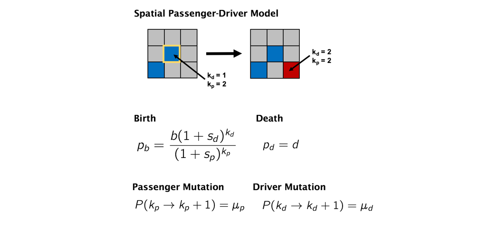
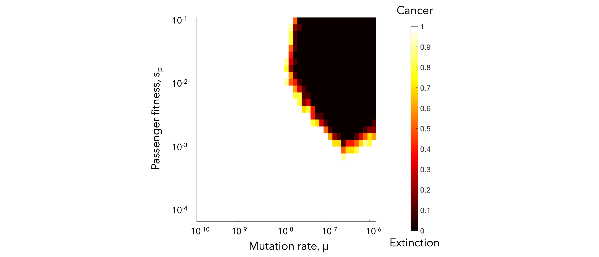

## Tissue structure modulates evolution: premalignant sweeps precede neutral expansion
#### Jeffrey West, Ryan O. Schenck, Chandler Gatenbee, Mark Robertson-Tessi, Alexander R. A. Anderson

This is the open-source code repository for the passenger-driver model of tumor evolution. We encourage you to begin by reading the manuscript here: (link coming soon). There is a two-dimensional on lattice agent-based model called PD2D and a three-dimensional on lattice agent-based model of tumor evolution for ductal carcinoma in situ.

## Before you start
PD2D.java and PD3D.java use the open-source agent-based modeling platform called [HAL](http://halloworld.org/). In order to run this code base, you'll need to download the latest version of [Java](http://www.oracle.com/technetwork/java/javase/downloads/jdk9-downloads-3848520.html) and an editor (we suggest using [IntelliJ Idea](https://www.jetbrains.com/idea/download/)).

### Setting up the project in IntelliJ Idea

1. Open Intellij Idea and click "create project from existing sources" ("file/ new/ project from existing sources" from the main GUI) and direct it to the unzipped AgentFramework Source code directory.
2. Continue through the rest of the setup, click next until it asks for the Java SDK:
- "/Library/ Java/ JavaVirtualMachines/" on Mac.
- "C:\ Program Files\ Java\" on Windows.
3. Once the setup is complete we will need to do one more step and add some libraries that allow for 2D and 3D OpenGL visualization:
4. open the Intellij IDEA main gui
5. go to "file/ project structure"
6. click the "libraries" tab
7. use the minus button to remove any pre-existing library setup
8. click the plus button, and direct the file browser to the "Framework/ lib" folder.
9. click apply or ok
		
## Model Overview
The following schematic shows the rules of the model. Each cell occupies a single lattice grid point (no overlapping cells) and is able to divide into neighboring empty grid space. During division, cells can accrue passenger (deleterious) or driver (advantageous) mutations.

The model has the following parameters:
- birth rate
- death rate
- mutation rate, mu
- Tp (the number of passenger genes)
- Td (the number of driver genes)
- r0 (the initial size of the tumor is a square: r0*r0)
- sideLen (the size of the domain)

The effective rate of driver mutations is mu * Td and the effective rate of passenger mutations is mu * Tp.

# PD2D - passenger driver evolution in 2D
### SingleSim()
Several sample simulations shown color-coded by driver mutation number (k_d) for varying size of tumor radius.

You can notice that a smaller domain (left) results in a more homogeneous domain of tumor cells. The spatial constrains allow newer clones (with more accumulated driver mutations) to sweep through the population quickly. Larger domains slow the speed of clonal sweep, leading to a highly heterogeneous population (right). 

Visually, it appears that the clone with the highest driver number (k_d) is roughly equivalent across small and large domains. This indicates that there is soomething of a trade-off between large domains with many cells (and therefore many cell divisions with lots of random mutations to accrue drivers) and a small domains with a tightly coupled, homogeneous population.

### SegregatedRegions()
This second example shows a homogeneous starting condition of (33% density) all single driver mutation cells with non-interacting segregated regions.

In order to look at this trade off more closely, we analyze identical domain sizes segregated into varying region sizes. Smaller regions have very low intra-region heterogeneity but very high inter-region heterogeneity. These regions are non-interacting, but in the next section we consider dispersal between regions.

### SegregatedRegionsWithDispersal()
This second example shows the effect of dispersal rate between segregated regions, which can be an accelerant of evolution.

Indentical domain sizes segregated into smaller regions allow for a tightly coupled population inside each region. As new clones are introduced, they sweep through the region easily, but must wait for a dispersal event. This segregated domain with dispersal is able to recapitulate a non-segregated single region's tumor driver evolution,  but with many less deleterious passenger mutations.

### Heatmaps()
This function iterates through values of fitness penalty (s_p) and mutation rate, and outputs a matrix of the number of simulations for which N > 0 after 10,000 timesteps (non-extinction events).

# PD3D - passenger driver evolution in 3D
### SingleSim()
The passenger driver model is extended to three dimensions and constrained to grow only inside the ductal network structure of a breast. This simulation of ductal carcinoma in situ becomes invasion when a cell acquires an invasive driver mutation (colored in yellow).

